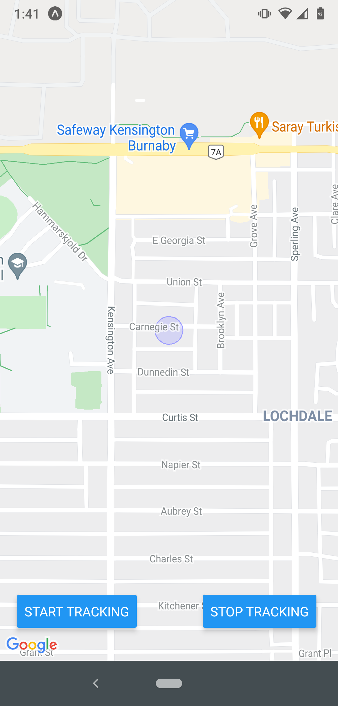
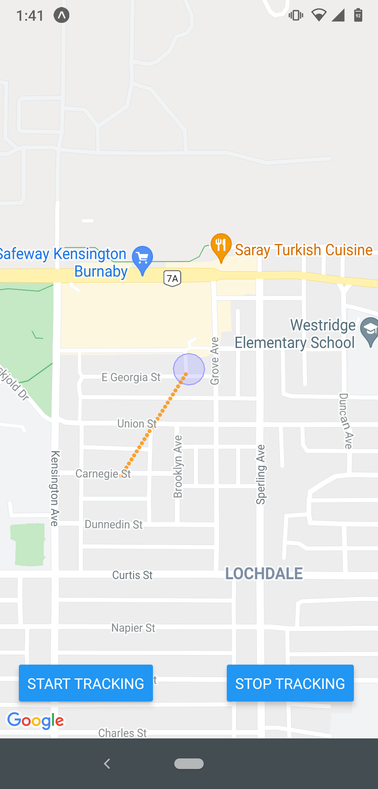
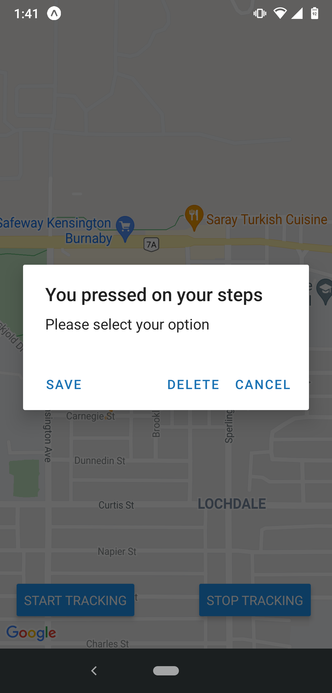

# Hansel And Gretel

Mobile application build using React Native that tracks individual steps and displays it on the map, so users can trace the steps they took to reach a particular location.

Users have the option to save the steps for future use or delete it.

## Screenshots

